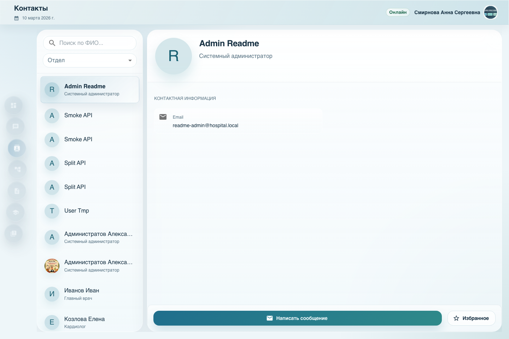
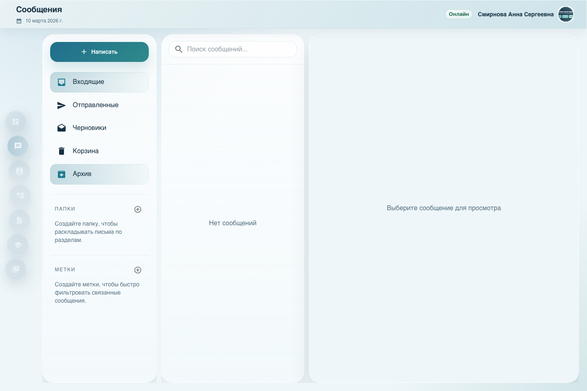
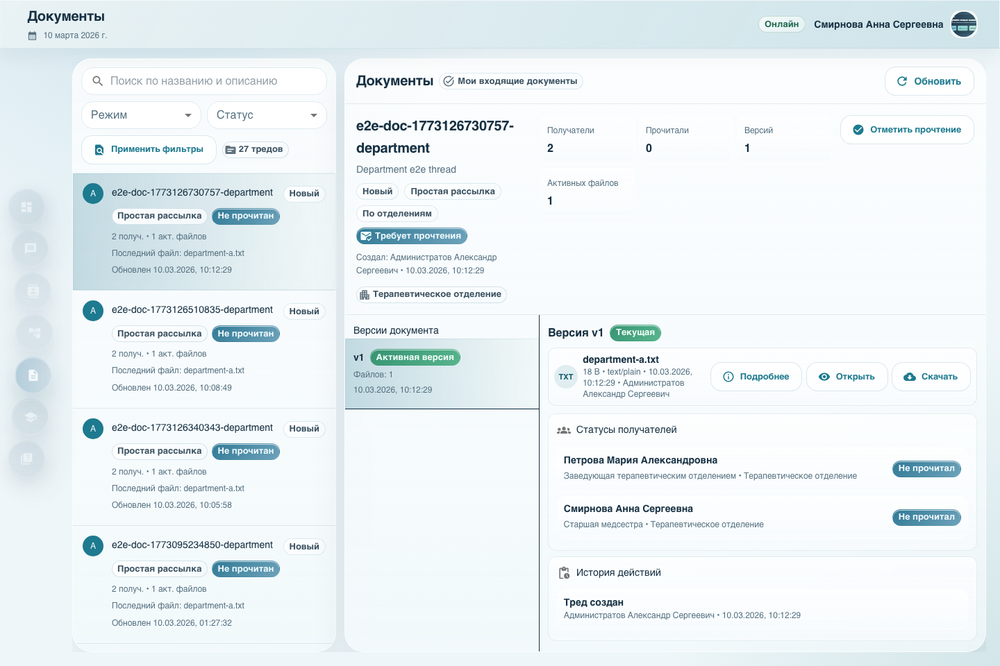
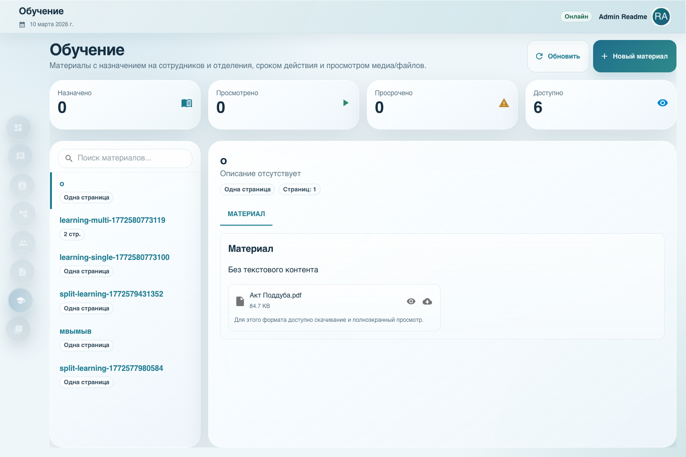
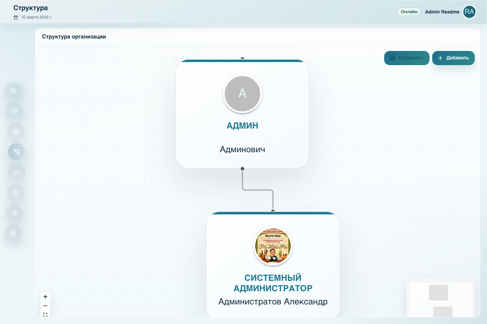
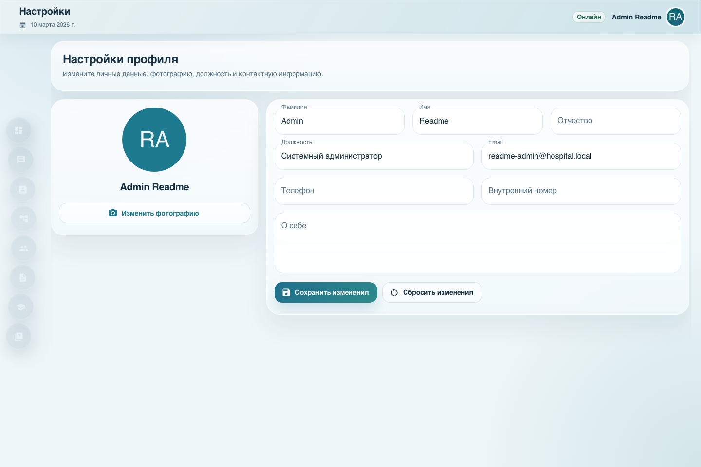

# ГАУЗ ОКБ №3 Веб-сервис для сотрудников

Внутренний веб-сервис для сотрудников больницы. Система рассчитана на установку на сервере учреждения и работу в локальной сети: без публичного доступа, без лишней сложности для пользователей и с понятным набором ежедневных рабочих сценариев.

Если по-простому, это единая точка входа для внутренней коммуникации и рабочих материалов. Здесь можно быстро найти коллегу, написать сообщение, разослать документ, назначить обучение, провести тестирование и держать организационную структуру в актуальном виде.

## Что можно делать в системе

### Для сотрудников

- читать внутренние новости и объявления;
- находить нужного коллегу по отделению, должности или имени;
- писать личные и рабочие сообщения внутри системы;
- получать документы, подтверждать ознакомление и отслеживать актуальные версии;
- проходить обучение и открывать назначенные материалы;
- проходить тесты и видеть результат;
- обновлять свой профиль и контактные данные.

### Для администратора

- управлять пользователями и правами доступа;
- собирать и поддерживать оргструктуру больницы;
- публиковать документы для отдельных сотрудников, отделений или групп;
- запускать обучение и тестирование по подразделениям;
- публиковать новости и важные внутренние сообщения;
- контролировать, кто ознакомился с документом и кто завершил назначенное обучение.

## Основные разделы

### Главная

Главная страница работает как внутренняя лента. Через неё удобно публиковать новости, срочные объявления, прикладывать файлы и закреплять важные материалы, чтобы сотрудники видели их сразу после входа.

### Сообщения

Полноценный внутренний модуль переписки. Есть входящие, отправленные, черновики, архив, свои папки и метки. Это удобно для ежедневной коммуникации внутри больницы без перехода в сторонние мессенджеры.

### Контакты

Единый справочник сотрудников с быстрым поиском, карточкой человека и переходом к переписке. Хорошо подходит для регистратуры, отделений, административного блока и любых внутренних рабочих коммуникаций.

### Документы

Один из самых полезных модулей в реальной работе. Документы можно рассылать индивидуально, по отделениям или группам, включать подтверждение прочтения, хранить версии и видеть статусы по получателям. По сути, это рабочий центр для приказов, распоряжений, памяток и внутренних регламентов.

### Обучение

Материалы назначаются сотрудникам или подразделениям, могут иметь срок действия и состоять из одной или нескольких страниц с файлами и вложениями. Это удобно для вводного обучения, инструктажей, регламентов и регулярного обновления знаний.

### Тестирование

Система позволяет создавать тесты, назначать их нужным сотрудникам, ограничивать попытки, задавать проходной балл и смотреть результаты. Подходит для проверки знаний после обучения, инструктажей и внутренних аттестаций.

### Структура

Визуальная оргструктура помогает держать в одном месте подразделения, руководителей и ключевые роли. Для больницы это особенно полезно, когда нужно быстро понять, кто за что отвечает и как связаны отделения между собой.

### Настройки профиля

У каждого сотрудника есть личный профиль с базовой информацией, фотографией и контактами. Это упрощает поиск коллег и поддержание актуального внутреннего справочника.

## Как это выглядит

Ниже несколько живых экранов из локальной сборки проекта. Это не макеты и не “концепт”, а реальные страницы работающей системы.

### Контакты

Здесь сотрудник быстро находит коллегу, видит должность и контактную информацию, а при необходимости сразу переходит к сообщению.



### Сообщения

Внутренняя переписка организована как привычная почта: папки, поиск, отдельная область просмотра и быстрый переход к написанию нового сообщения.



### Документы

В документном модуле видно сам тред, статусы получателей, историю действий и версии файлов. Это особенно удобно для приказов и обязательных к ознакомлению материалов.



### Обучение

Материалы обучения можно просматривать прямо в системе, назначать сотрудникам и отслеживать статус прохождения.



### Структура организации

Оргструктура оформлена визуально и редактируется прямо из интерфейса, без необходимости держать отдельные схемы и таблицы.



### Профиль сотрудника

Личный кабинет сделан без лишней перегрузки: сотрудник может обновить основные данные и поддерживать профиль в актуальном состоянии.



## Быстрый запуск для заказчика

Это основной сценарий финальной передачи проекта. Скрипты `install.sh`, `install.ps1` и `install.cmd` рассчитаны именно на чистую первую установку без demo-данных.

Что делают скрипты:

- сразу печатают, что именно нужно скачать для запуска;
- создают корневой `.env` с безопасными случайными значениями, если файла ещё нет;
- поднимают `postgres`, `backend` и `frontend` одной командой;
- ждут health-check всех контейнеров;
- проверяют, что в базе создан только один активный администратор, всего пользователей `1`, отделений `0`;
- проверяют, что вход под этим администратором действительно работает.

Важно: это именно сценарий чистой установки. По умолчанию скрипты удаляют старые Docker volumes этого проекта. Для обычного повторного запуска без сброса данных используйте флаг `--keep-data` на macOS/Linux или `-KeepData` на Windows.

### Что нужно скачать

- Windows: `Docker Desktop for Windows` - <https://www.docker.com/products/docker-desktop/>
- macOS: `Docker Desktop for Mac` - <https://www.docker.com/products/docker-desktop/>
- Linux: `Docker Engine` - <https://docs.docker.com/engine/install/> и `Docker Compose plugin` - <https://docs.docker.com/compose/install/linux/>

Больше ничего для запуска из каталога проекта не требуется.

### Команда запуска

macOS / Linux:

```bash
bash ./install.sh
```

Windows PowerShell:

```powershell
powershell -ExecutionPolicy Bypass -File .\install.ps1
```

Windows CMD:

```bat
install.cmd
```

После завершения скрипт сам выведет:

- адрес входа;
- email администратора;
- пароль администратора;
- результат проверки, что в базе нет лишних пользователей и отделений.

Если стандартные порты уже заняты на машине заказчика, install-скрипты сами выберут ближайшие свободные порты и покажут итоговый адрес входа в финальном сообщении.

Если нужно заранее зафиксировать свои реквизиты администратора:

macOS / Linux:

```bash
bash ./install.sh --admin-email=admin@hospital.local --admin-password=StrongPass123!
```

Windows PowerShell:

```powershell
powershell -ExecutionPolicy Bypass -File .\install.ps1 -AdminEmail admin@hospital.local -AdminPassword StrongPass123!
```

Для повторного запуска без удаления данных:

macOS / Linux:

```bash
bash ./install.sh --keep-data
```

Windows PowerShell:

```powershell
powershell -ExecutionPolicy Bypass -File .\install.ps1 -KeepData
```

Важно: для заказчика не нужно выполнять `npm run db:seed`. Demo-пользователи и demo-структура предназначены только для локальной разработки.

## Ручное развертывание через Docker Compose

Проект можно развернуть на одном сервере внутри локальной сети больницы. Базовый сценарий выглядит так:

1. Установить на сервер `Docker` и `docker compose`.
2. Склонировать репозиторий:

```bash
git clone <repo-url>
cd webservice_project
```

3. Создать в корне проекта файл `.env` на основе примера:

```bash
cp .env.example .env
```

И при необходимости скорректировать значения:

```env
POSTGRES_PASSWORD=strong-db-password
JWT_SECRET=strong-jwt-secret
FRONTEND_URLS=http://localhost:8080,http://127.0.0.1:8080
BOOTSTRAP_ADMIN_EMAIL=admin@hospital.local
BOOTSTRAP_ADMIN_PASSWORD=StrongPass123!
```

4. Запустить систему:

```bash
docker compose up -d --build
```

5. После запуска открыть в браузере:

```text
http://<IP_сервера>:8080
```

При первом старте backend сам применит миграции и создаст первого администратора из переменных `BOOTSTRAP_ADMIN_EMAIL` и `BOOTSTRAP_ADMIN_PASSWORD`.

## Что было исправлено перед передачей

Во время проверки запуска на чистом ПК выяснилось, что репозиторий и инструкция были рассчитаны в первую очередь на локальную разработку, а не на быстрый production-запуск у заказчика. Из-за этого тестировщик не мог поднять систему «по README» без ручных правок.

Что изменили:

- в `docker-compose.yml` добавили полноценный запуск `backend` и `frontend`: раньше compose поднимал только `postgres`, а web-приложение нужно было запускать отдельно;
- добавили корневой `.env.example` и описали обязательные переменные для production-запуска: `POSTGRES_PASSWORD`, `JWT_SECRET`, `FRONTEND_URLS`, `BOOTSTRAP_ADMIN_EMAIL`, `BOOTSTRAP_ADMIN_PASSWORD`;
- добавили `Dockerfile` для backend и frontend, чтобы проект можно было собрать и запустить одной командой `docker compose up -d --build`;
- настроили `Nginx` во frontend-контейнере и проксирование `/api`, `/socket.io` и `/uploads`, чтобы frontend корректно работал за одним адресом `http://<IP_сервера>:8080`;
- перевели frontend Docker-сборку на `VITE_API_URL=/api`, потому что прямой адрес `http://localhost:3001/api` подходит для разработки, но ломает работу на сервере;
- добавили автоматическое применение миграций при старте backend-контейнера;
- добавили bootstrap-создание первого администратора через `BOOTSTRAP_ADMIN_EMAIL` и `BOOTSTRAP_ADMIN_PASSWORD`, чтобы после первого запуска можно было сразу войти в систему без ручного seed для production;
- разделили production- и demo-инициализацию: demo-аккаунты и тестовые данные остались только для локальной разработки.

## Для разработки

Если проект нужно запускать локально без полной Docker-сборки, удобнее оставить в контейнере только Postgres, а backend и frontend запускать в отдельных терминалах.

Корневой `.env` нужен для `docker compose`. Для локального backend нужен отдельный файл `backend/.env`.

1. Подготовить переменные окружения:

```bash
cp backend/.env.example backend/.env
cp frontend/.env.example frontend/.env
```

2. Поднять только Postgres:

```bash
docker compose up -d postgres
```

3. Установить зависимости и подготовить базу:

```bash
cd backend
npm install
npm run db:migrate:deploy
npm run db:seed

# Frontend
cd ../frontend
npm install
```

4. Запустить backend и frontend в двух отдельных терминалах:

```bash
# Терминал 1
cd backend
npm run dev

# Терминал 2
cd frontend
npm run dev
```

Если нужен доступ к frontend с другого устройства в локальной сети, запускайте Vite так:

```bash
npm run dev -- --host 0.0.0.0
```

Важно: `npm run db:seed` нужен для локальной разработки, потому что именно он создаёт demo-пользователей `admin@hospital.local / admin123` и `nurse1@hospital.local / user123`.

Если `backend` не может подключиться к Postgres после смены `POSTGRES_PASSWORD`, проблема обычно в старом Docker volume: пароль в уже инициализированной базе не меняется автоматически вместе с `.env`. В этом случае либо верните прежний пароль в `backend/.env`, либо пересоздайте volume Postgres и снова выполните `docker compose up -d postgres`.

По умолчанию:

- frontend: `http://localhost:5173`
- backend API: `http://localhost:3001/api`

Тестовые учётные записи нужны только для локальной разработки и demo-сценариев.

| Роль | Email | Пароль |
|------|-------|--------|
| Администратор | `admin@hospital.local` | `admin123` |
| Сотрудник | `nurse1@hospital.local` | `user123` |

## Технологии

Проект собран на привычном и понятном стеке:

- backend: `Node.js`, `Express`, `TypeScript`, `Prisma`, `PostgreSQL`, `Socket.IO`;
- frontend: `React`, `TypeScript`, `Vite`, `Material UI`, `TanStack Query`, `Zustand`;
- инфраструктура: `Docker`, `docker compose`, `Nginx` во frontend-контейнере.

## Структура репозитория

```text
webservice_project/
├── backend/     # API, бизнес-логика, Prisma, загрузки файлов
├── frontend/    # клиентское приложение
├── docs/        # скриншоты и сопроводительные материалы
└── docker-compose.yml
```
